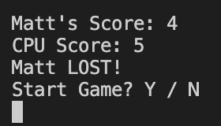

# Rock, Paper, Scissors Application

Rock, Paper, Scissors application is a <a href="https://en.wikipedia.org/wiki/Python_(programming_language)">Python</a> terminal game, based on the classic hand game, which runs in the Code Institute mock terminal on <a href="https://en.wikipedia.org/wiki/Heroku">Heroku</a>.

Users face the challenge of beating the computer by choosing between rock, paper or scissors.

<a href="https://rock-paper-scissors-python-app.herokuapp.com/">Live version of project.<a>

  <h2>How to play</h2>
  
Rock, paper, scissors is a hand game that originated from China, and this app is based on that classic two player game.(More details and history about the game <a href="https://en.wikipedia.org/wiki/Rock_paper_scissors">here</a>.)

  
In this version of the hand game, the player is first asked whether they'd like to play the game or not. If they choose to play the game the user can then enter their player name and then they are asked "Rock, Paper, Scissors?". This is where the player must type in one of the three items available to compete against the computer. Depending on the computers choice of 'weapon' the user will gain 1 point for a win, the player that scores 5 points first is the winner!

  
The following scenarios are how to score points (1pt for each):

  <ul>
    <li>Rock beats Scissors.</li>
    <li>Paper beats Rock.</li>
    <li>Scissors beat Paper.</li>
  </ul>
  
  <h2>Features</h2>
  <h3>Exisitng Features:</h3>
  <ul>
    <li>Create player name.</li>
      <ul>
        <li>This feature enables the user to create a player name that is used throughout the game.</li>
      </ul>
    
    <li>Play against the computer.</li>
    <li>Scoring System.</li>
    <li>Round result message.</li>
    <li>Computers item choice.</li>
    <ul>
      <li>A scoring system updates the score after every round.</li>
      <li>After each round is complete a message is presented displaying the result of that round.</li>
      <li>Once the player has entered their choice of 'weapon' and hit enter, the computers choice of item is revealed.</li>
    </ul>
    
     
    
    <li>Input validation.</li>
    <ul>
      <li>User must enter a valid response, for when starting game and when choosing a 'weapon'.</li>
      <li>If user uses an invalid response, the programme displays an error message containg what the problem is.</li>
    </ul>
    
    
    <li>Restart game.</li>
    <ul>
      <li>When the score of 5 points has been reached by either player, the final scores are displayed, along with a message and the chance to play again.</li>
    </ul>
    
  </ul>
  
  <h3>Future Features:</h3>
  <ul>
    <li>Total points to win limit setting.
      <ul>
        <li>Allow the user to set their limit of points to win a game.</li>
      </ul>
    </li>
  </ul>
  
  <h2>Project Structure</h2>
  
The structure of my project is solely based around a while loop. The loop contains all the key features including the scoring system, player input, invalid inputs and print statements.

  <h2>Testing</h2>
  
  
I have tested this programme through the following methods:

  <ul>
    <li>Passed code through a PEP8 linter and confirmed there are no problems.</li>
    <li>Given invalid inputs/responses. Responded with incorrect options, out of bound inputs for example numbers and unrecognised words.</li>
    <li>Tested in my local terminal and the Code Institute Heroku terminal.</li>
  </ul>
  
  <h2>Bugs</h2>
  <h3>Solved Bugs:</h3>
  <ul>
    <li>After writing the limited total of points to win the game feature and running the programme, I noticed that when a player won they got 1 point but then when playing the next move the scores were reset to 0. Originally I wrote this code outside the while loop but then realised it has to be within the loop to increment the players scores after every move.</li>
    <li>Ending the game was a bit of an issue. I originally created a function outside the main_game function, and called it within the while loop, but this did not work. I wrote the code that i wrote within the endgame function, that was created, within the while loop and this solved the issue, allowing the player to restart or end the game.</li>
  </ul>
  <h3>Remaining Bugs:</h3>
  <ul>
    <li>The deployed version of the programme, visually, could be improved. All the text is up against the left side of the terminal, no space between text and side of terminal.</li>
    
  </ul>
  <h3>Validator Testing:</h3>
  <ul>
    <li>Passed code through PEP8 linter.</li>
    <ul>
      <li>No errors were returned.</li>
      
    </ul>
  </ul>

<h2>Deployment</h2>

This project was deployed using Code Institute's mock terminal for Heroku.

<ul>
<li>Deployment steps:</li>
<ul>
  <li>Cloned this repository</li>
  <li>Create new Heroku app.</li>
  <li>Set buildpacks to Python and <a href="https://en.wikipedia.org/wiki/Node.js">NodeJS</a> in that order.</li>
  <li>Link the Heroku app to my <a href="https://en.wikipedia.org/wiki/GitHub">github</a> repository.</li>
  <li>Set a config var.</li>
  <li>Click on <strong>Deploy Branch</strong>.</li>
</ul>
<ul>

<h2>Credits</h2>
<ul>
<li><a href="https://codeinstitute.net/">Code Institute</a> for the deployment terminal.</li>
<li><a href="https://en.wikipedia.org/wiki/Main_Page">Wikipedia</a> for details of the Rock, Paper, Scissors game.</li>
<li><a href="https://thehelloworldprogram.com/python/python-game-rock-paper-scissors/">The Hello World Programme</a> for influencing me to create this project and as a stepping stone to get me started on the project.</li>
</ul>
